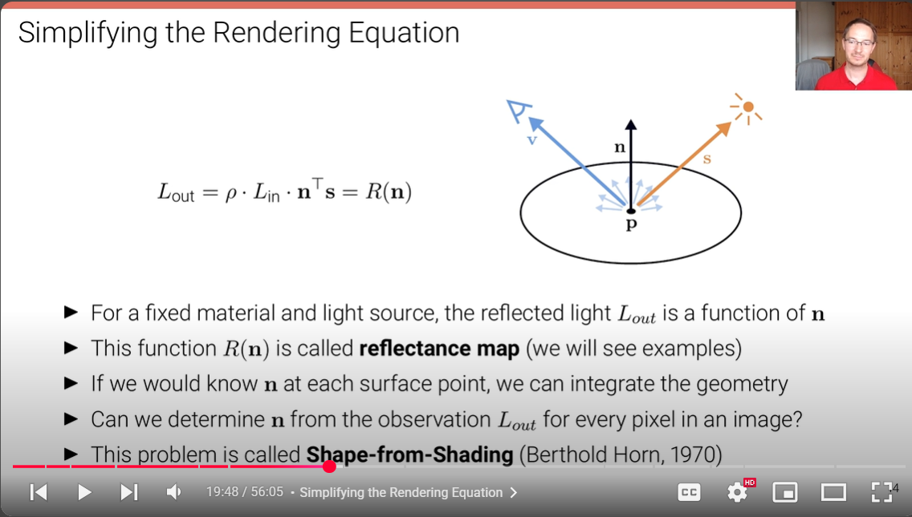
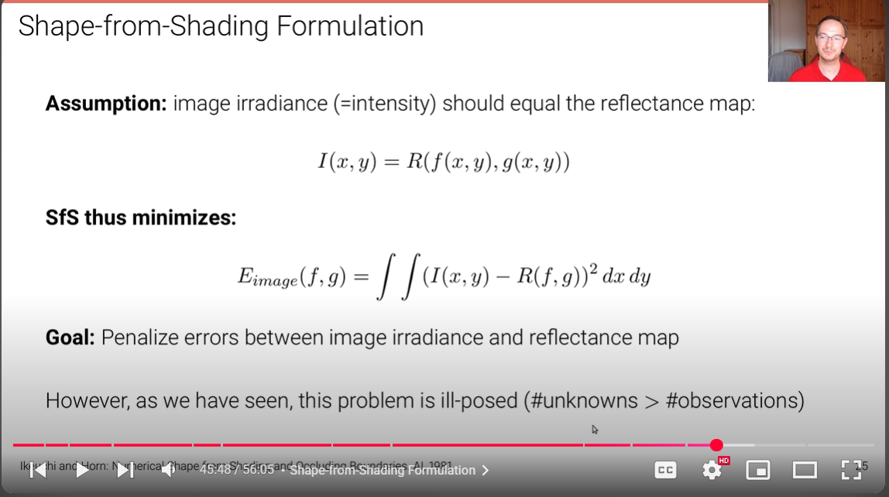
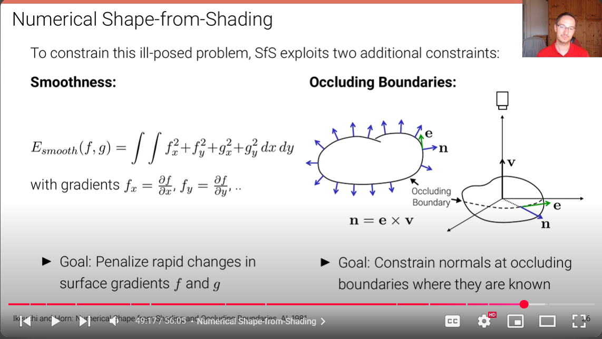
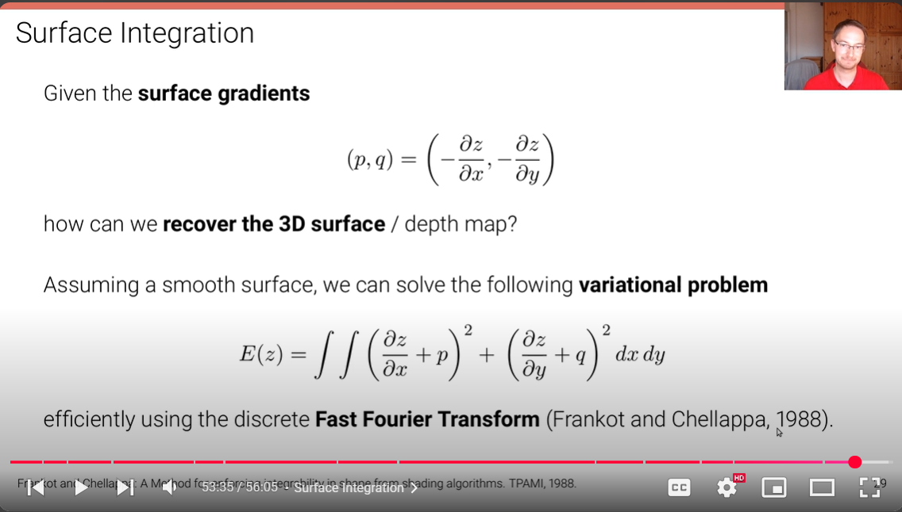

# BAH-Docs

---

# SFS(Shape from shading)

1. The whole thing is very general
2. For best case `SFS` We have to get on build on some Prior info

What is our Prior info here??

_____

For this particular problem?

---

# Rendering Eqn

This eqn will be simplified using certain assumptions about world

The new n can be used to generate geometry

Now we knoe `Lout` . Using this we calculate n. and Then maybe form geometry.

---

# Some assumptions of SFS

We need to add more assumptions related to our case

What are more asumptions we can use to get more close to our case??

______

---

# Simplfying and param eqn

Further analysis and considerations for the SFS implementation.

Chatgpt content for Easy understanding of eqn.

## 🌄 What’s This About?

We’re trying to figure out the **shape (depth)** of a surface (like the Moon’s terrain) from **a single image**, just by analyzing the **brightness at each pixel**.

This is possible because:

> The **brighter** an area is, the more directly it faces the **light source** (e.g., the Sun).
>
> The **darker** it is, the more it’s tilted **away** from the light.

So, if we understand how light reflects off a surface, we can work **backward** and estimate the **3D shape**.

## 📘 Concepts in the Slide

### 🧭 1. **The Surface Normal (`n`)**

In 3D geometry, a **normal** is a vector that points straight up from a surface — like a flagpole stuck into a hill.

Why do we care about this?

* The way light hits the normal determines how **bright the surface looks**.
* So if we can **estimate the normal**, we can understand the **slope** of the surface.

### 🔢 2. **Parameterizing the Normal using Gradients**

#### 🔹 What is a Gradient?

It means **how quickly the surface changes** in the x and y directions — like:

* `∂z/∂x` → how steep the slope is **left to right**
* `∂z/∂y` → how steep the slope is **top to bottom**

This is written as:

$$
(p, q) = \left(-\frac{\partial z}{\partial x},\ -\frac{\partial z}{\partial y}\right)
$$

These are just the **slopes** in the x and y directions. The **minus signs** are convention — it's common to write normals in this flipped way.

#### 🧠 Think of it like this:

If `p = 2`, then for every 1 step you move in x, the height (z) increases by 2 — steep hill!
If `q = 0`, there’s **no slope** in y direction.

### 🧭 3. **How Do We Write the Normal Vector?**

The **normal vector n** is just the direction "straight out" from the surface at any point. Based on `(p, q)`:

$$
\mathbf{n} = \frac{(p, q, 1)^\top}{\sqrt{p^2 + q^2 + 1}}
$$

This makes a 3D vector from:

* Slope in x (`p`)
* Slope in y (`q`)
* Always "1" in z to keep things consistent

The denominator ensures it's a **unit vector** (i.e., length = 1).

### 🔍 Example from Slide

They show a vector:

$$
\mathbf{n} = \frac{(2, 1)}{\sqrt{2^2 + 1}} = \frac{(2, 1)}{\sqrt{5}}
$$

This means:

* The x-direction slope is 2 (steep)
* The y-direction slope is 1 (less steep)
* The surface is tilted accordingly

You can imagine a tilted plane that rises **2 meters in x** and **1 meter in y** for every **1 meter forward**.

## ☀️ 4. Reflectance Equation (Brightness = Light ⋅ Surface Normal)

When light hits a surface, the **brightness** depends on the angle between the **light direction** (`s`) and the **surface normal** (`n`).

$$
R(\mathbf{n}) = \mathbf{n}^\top \mathbf{s} = \frac{p s_x + q s_y + s_z}{\sqrt{p^2 + q^2 + 1}}
$$

Where:

* `R(n)` = how bright the pixel looks
* `(s_x, s_y, s_z)` = direction of the light (e.g., Sun)
* `(p, q)` = slope in x and y

> This formula tells you how much of the light hits the surface **head-on** (brighter) vs **at an angle** (dimmer).

### 📊 Visual Representation of Reflectance Map

This visual shows how the reflectance varies across different slope values (p, q). The reflectance map helps us understand the relationship between surface orientation and brightness, which is crucial for the Shape from Shading algorithm.

### 🌞 Example

Say the sunlight comes from the direction:

$$
\mathbf{s} = (0, 0, 1)
$$

That means the light comes from **directly above**.

Now if the surface is flat (i.e., `p = 0`, `q = 0`):

$$
R = \frac{0 \cdot 0 + 0 \cdot 0 + 1}{\sqrt{0^2 + 0^2 + 1}} = 1
$$

\=> Fully lit (bright)

But if `p = 2, q = 1` (very tilted surface):

$$
R = \frac{2s_x + 1s_y + s_z}{\sqrt{2^2 + 1^2 + 1}} = \text{less than 1}
$$

\=> Partially lit (dimmer)

## ✅ Summary (Newbie-Friendly)

| Symbol | Meaning                    | Intuition                             |
| ------ | -------------------------- | ------------------------------------- |
| `z`    | Height of the surface      | Terrain elevation                     |
| `p`    | `-∂z/∂x` → slope in x      | How fast height changes left-to-right |
| `q`    | `-∂z/∂y` → slope in y      | How fast height changes top-to-bottom |
| `n`    | Normal vector              | Which way the surface "points"        |
| `s`    | Light direction (like Sun) | Where the light is coming from        |
| `R(n)` | Brightness                 | How much light hits the surface       |

---

# Solutions to N

Different approaches and methods for solving the normal vector N in Shape from Shading problems. This section explores various computational techniques and mathematical solutions for determining surface normals from intensity information.

1. Ofcourse n in not unique. It lies in the ecllipse.
2. This is because we have one known `Lout` and 2 unknown ps, qs.

There's one exception to this. When cos0 means s and n overlap and ther's only one solution that is a point. Means all ellipse when collapse to a point.
3. Special case when p and q goes to infinity To handle n.

---

# Further Analysis and Implementation

This section covers additional implementation details and advanced considerations for the Shape from Shading algorithm. The image shows further mathematical formulations and practical approaches for handling edge cases and optimizing the SFS solution.

# Penalising and Constraints

As here unknwons are greater than knowns
We have to specify constraints and penalisation creteria's.

The two Constraints are

---

# Normal Map to Surface geometry

1. We have p,q surface gradients. Means access to the gradients.

